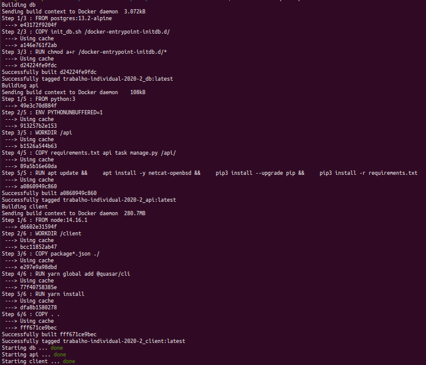
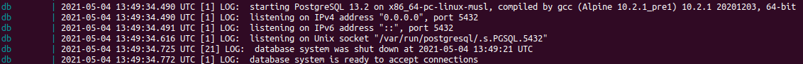
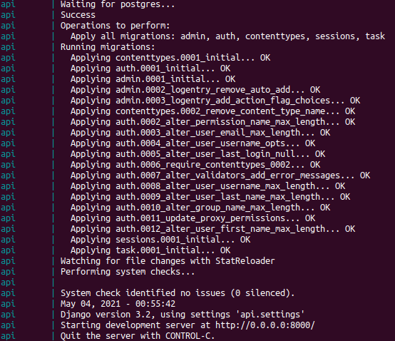
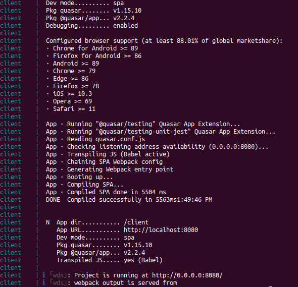

  [](https://codeclimate.com/github/iurisevero/Trabalho-Individual-2020-2/maintainability) [](https://codecov.io/gh/iurisevero/Trabalho-Individual-2020-2)

# Trabalho Individual 2020.2

| Aluno | Matrícula |
| --- | --- |
| Iuri de Souza Severo Alves | 17/0145514 |

Para executar a aplicação em sua máquina de forma manual, basta seguir o passo-a-passo descrito no arquivos s README das pastas [api](./api/README.md) e [client](./client/README.md). É recomendado criar um ambiente virtual caso vá seguir esses passos.

### 1. Containerização

A containerização da aplicação se deu a partir de três Dockerfiles:
* [Dockerfile PostgreSQL](./api/postgresql/Postgresql.Dockerfile)
* [Dockerfile API](./api/Django.Dockerfile)
* [Dockerfile Client](./client/Quasar.Dockerfile)

E a orquestração dos containers foi feita utilizando o Docker-compose, com a configuração descrita no arquivo [docker-compose.yaml](./docker-compose.yaml).

Para executar a aplicação pasta utilizar o comando
```
docker-compose up --build
```

Os resultados esperados do comando são os seguintes:
* Build

* Banco de Dados

* API

* Client


Obs: O log do container do banco de dados está apresentando apenas a mensagem de quando o banco já está criado. O log completo ficaria muito grande.

Após a build, o aplicativo pode ser acessado no `localhost:8080` e a api pode ser acessada no `localhost:8080/`.

### 2. Integração contínua

A integração contínua foi feita utilizando o GitHub Actions e foram criados três workflows:
* [CI API](./.github/workflows/api-ci.yml)
* [CI Client](./.github/workflows/client-ci.yml)
* [Coverage](./.github/workflows/coverage.yml)

O _workflow_ da API e do Client tem etapas similares, com dois _jobs_, um de pre-build e um de build e teste. O _job_ de pre-build utiliza o [skip-duplicate-actions](https://github.com/fkirc/skip-duplicate-actions) para otimizar o CI e evitar rodar trabalhos desnecessários, enquanto o de build e teste roda o comando do docker-compose para criar os containers específicos e rodar a verificação da qualidade de código e da cobertura de testes. Eles são executados quando acontecem commits na branch master ou quando são abertor Pull Requests.

O _workflow_ de Coverage é executado na master após a conclusão dos _workflows_ do Client e da API e nele é feita a build do programa, utilizando docker-compose, são gerados os relatórios da cobertura de testes e enviados ao codecov, utilizando a [codecov action](codecov/codecov-action).

Ainda há um quarto _workflow_ realizado pelo CodeClimate para verificação da qualidade de código por uma ferramenta externa. A configuração desse _workflow_ é feita a partir do arquivo [.codeclimate.yml](./.codeclimate.yml).

### 3. Deploy contínuo

Não foi realizado o deploy da aplicação. :sad: